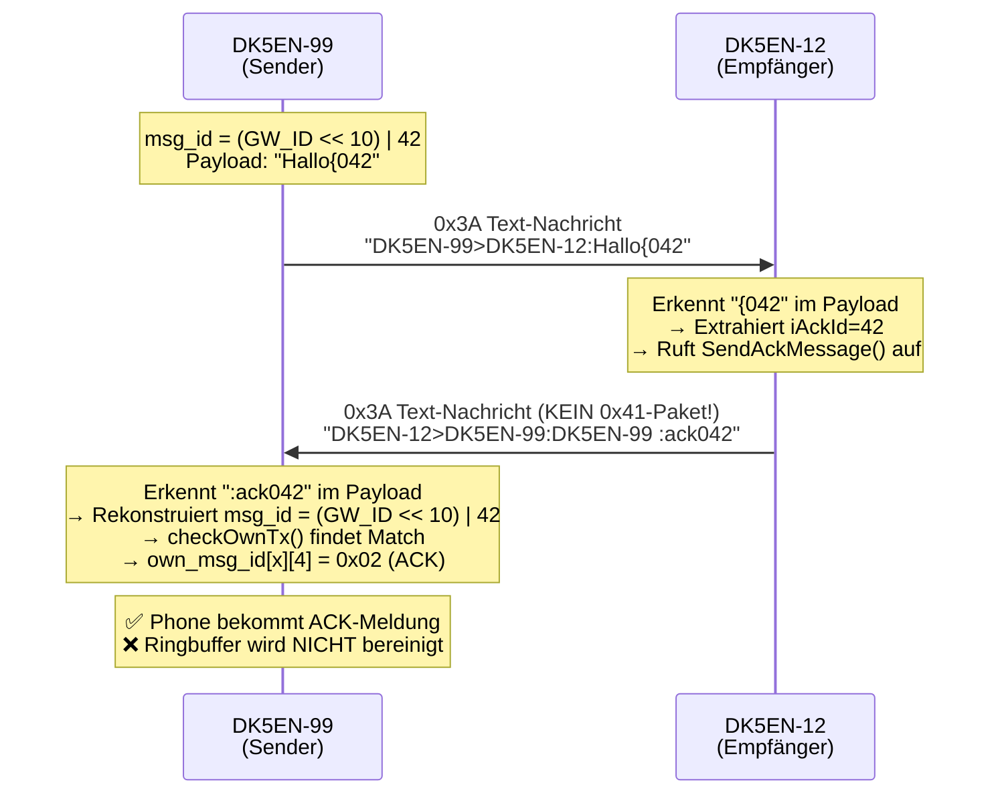
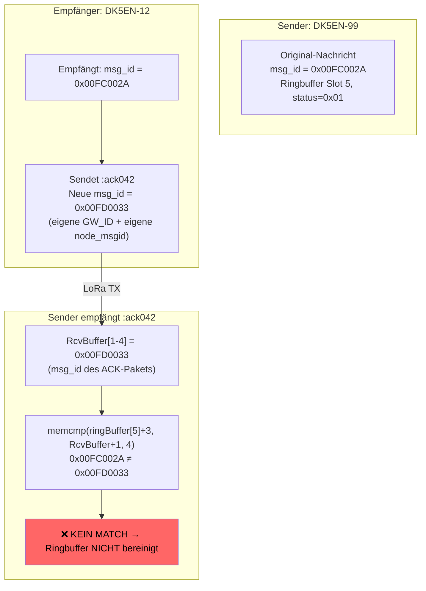
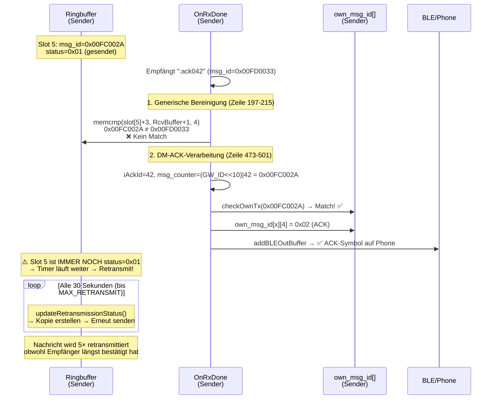
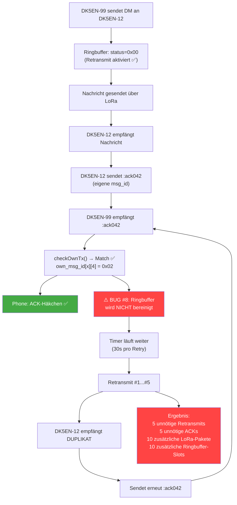

# MeshCom Firmware — Fehleranalyse Direktnachrichten (DM) Retransmit & ACK

**Firmware-Version:** 4.35k (main branch)
**Datum:** 2026-02-22
**Betrifft:** `lora_functions.cpp`, `loop_functions.cpp`
**Verwandt:** [BUG_REPORT_RINGBUFFER_ANALYSE.md](BUG_REPORT_RINGBUFFER_ANALYSE.md) (BUG #1–#6)

---

## Zusammenfassung

Direktnachrichten (DM) zwischen zwei Knoten verwenden ein eigenes ACK-System, das sich grundlegend vom 0x41-ACK-Paket der Gruppen- und Broadcast-Nachrichten unterscheidet. Dieses System enthält zwei Fehler, die dazu führen, dass DM-Nachrichten entweder **nie retransmittiert** werden, oder dass der Sender **trotz erfolgreichem ACK weiter retransmittiert**.

---

## Inhaltsverzeichnis

1. [DM-Nachrichtenfluss im Überblick](#1-dm-nachrichtenfluss-im-überblick)
2. [BUG #7 — DM-Nachrichten werden als 0xFF markiert (kein Retransmit)](#2-bug-7--dm-nachrichten-werden-als-0xff-markiert-kein-retransmit)
3. [BUG #8 — Ringbuffer wird trotz ACK-Empfang nicht bereinigt](#3-bug-8--ringbuffer-wird-trotz-ack-empfang-nicht-bereinigt)
4. [Zusammenspiel der beiden Bugs](#4-zusammenspiel-der-beiden-bugs)
5. [Empfehlungen](#5-empfehlungen)

---

## 1. DM-Nachrichtenfluss im Überblick

DM-Nachrichten (z.B. DK5EN-99 → DK5EN-12) verwenden **nicht** das 0x41-ACK-Paket wie Gruppennachrichten. Stattdessen wird ein textbasiertes ACK-System verwendet:



### Nachrichtenstruktur auf dem Draht

```
Sender-Nachricht (msg_buffer):
  [0]    = 0x3A (Text-Typ)
  [1-4]  = msg_id (Little-Endian) ← z.B. 0x00FC002A
  [5]    = max_hop | Flags
  [6+]   = "DK5EN-99>DK5EN-12:Hallo{042\0"

Ringbuffer-Layout:
  ringBuffer[slot][0]   = Nachrichtenlänge
  ringBuffer[slot][1]   = Status-Byte (0x00=senden, 0xFF=erledigt)
  ringBuffer[slot][2]   = 0x3A (kopiert aus msg_buffer[0])
  ringBuffer[slot][3-6] = msg_id (kopiert aus msg_buffer[1-4])
  ringBuffer[slot][7+]  = Rest der Nachricht
```

### DM-Nachricht vs. Gruppen-Nachricht

| Eigenschaft | Gruppen-Nachricht (Grp 9) | Direkt-Nachricht (DM) |
|-------------|---------------------------|------------------------|
| **Payload** | `"Hallo"` | `"Hallo{042"` |
| **ACK-Typ** | 0x41-Paket (12 Bytes) | 0x3A Text `:ack042` |
| **ACK enthält** | msg_id in Bytes 6-9 | Nur 3-Ziffern AckId |
| **bDM Flag** | `false` | `true` |
| **startsWith("{")** | Nein → `status=0x00` ✅ | Nein → `status=0x00` ✅ |

---

## 2. BUG #7 — DM-Nachrichten werden als 0xFF markiert (kein Retransmit)

### Betroffener Code

```
Datei: loop_functions.cpp, Zeile 2347-2360

ringBuffer[iWrite][0]=aprsmsg.msg_len;
memcpy(ringBuffer[iWrite]+2, msg_buffer, aprsmsg.msg_len);

if (ringBuffer[iWrite][2] == 0x3A) // only Messages
{
    if(aprsmsg.msg_payload.startsWith("{") > 0)
        ringBuffer[iWrite][1] = 0xFF; // ⚠️ Kein Retransmit
    else
        ringBuffer[iWrite][1] = 0x00; // Retransmit aktiviert
}
```

### Analyse

Für eine DM von DK5EN-99 an DK5EN-12 mit der Nachricht `"Hallo"`:

1. **Payload-Aufbau** (Zeile 2280-2284):
   ```cpp
   if(bDM)  // true für DM
   {
       snprintf(cAckId, sizeof(cAckId), "%03i", meshcom_settings.node_msgid);
       aprsmsg.msg_payload = strMsg + "{" + String(cAckId);
       // Ergebnis: "Hallo{042"
   }
   ```

2. **Status-Prüfung** (Zeile 2352):
   ```cpp
   if(aprsmsg.msg_payload.startsWith("{") > 0)
   ```
   - Payload ist `"Hallo{042"` → beginnt mit `"H"`, **nicht** mit `"{"`
   - `startsWith("{")` ergibt `false`
   - **Ergebnis: `status = 0x00`** → Retransmit ist aktiviert ✅

### Ergebnis für BUG #7

**Überraschung: Dieser Bug existiert NICHT für DM-Nachrichten.** Die `startsWith("{")`-Prüfung fängt nur Systemnachrichten wie `{CET}`, `{MCP}`, `{SET}` ab, die tatsächlich mit `{` beginnen. DM-Payloads wie `"Hallo{042"` beginnen mit dem Nachrichtentext und werden korrekt mit `status=0x00` markiert.

**Allerdings gibt es ein Randfall-Problem:** Falls der Benutzer eine Nachricht sendet, die **mit `{` beginnt** (z.B. `"{test}"` oder `"{emoji}"`), wird diese irrtümlich als Systemnachricht behandelt und **nicht retransmittiert**:

```
Benutzer tippt: "{test} hallo"
Payload wird:   "{test} hallo{042"
startsWith("{") = true → status = 0xFF → KEIN Retransmit ⚠️
```

---

## 3. BUG #8 — Ringbuffer wird trotz ACK-Empfang nicht bereinigt

### Das eigentliche Problem

Auch wenn der Sender das ACK korrekt erkennt (über `checkOwnTx()`), wird der **Ringbuffer-Eintrag nicht auf `0xFF` gesetzt**. Die Nachricht wird deshalb weiter retransmittiert, obwohl das ACK bereits empfangen wurde.

### Betroffener Code — Sender empfängt `:ack042`

```
Datei: lora_functions.cpp, Zeile 473-501

if(iAckPos > 0 || aprsmsg.msg_payload.indexOf(":rej") > 0)
{
    // ":ack042" gefunden → msg_id rekonstruieren
    unsigned int iAckId = (aprsmsg.msg_payload.substring(iAckPos+4)).toInt();
    msg_counter = ((_GW_ID & 0x3FFFFF) << 10) | (iAckId & 0x3FF);

    print_buff[0]=0x41;
    print_buff[1]=msg_counter & 0xFF;
    print_buff[2]=(msg_counter >> 8) & 0xFF;
    print_buff[3]=(msg_counter >> 16) & 0xFF;
    print_buff[4]=(msg_counter >> 24) & 0xFF;
    print_buff[5]=0x02;  // ACK
    print_buff[6]=0x00;

    int iackcheck = checkOwnTx(msg_counter);   // ✅ Findet Match
    if(iackcheck >= 0)
    {
        own_msg_id[iackcheck][4] = 0x02;       // ✅ Markiert als "ACK empfangen"
    }

    addBLEOutBuffer(print_buff, 7);             // ✅ Phone bekommt ACK-Meldung

    // ⚠️ FEHLT: Ringbuffer-Eintrag auf 0xFF setzen!
    // Der Original-Eintrag im Ringbuffer wird NICHT bereinigt.
}
```

### Warum die generische Ringbuffer-Bereinigung NICHT greift

Es gibt eine generische Bereinigung bei jedem eingehenden Nicht-ACK-Paket:

```
Datei: lora_functions.cpp, Zeile 197-215

// Wird für JEDES eingehende Nicht-0x41-Paket ausgeführt
for(int ircheck=0;ircheck<MAX_RING;ircheck++)
{
    if(ringBuffer[ircheck][0] > 0 && ringBuffer[ircheck][1] != 0xFF)
    {
        // Vergleicht msg_id des eingehenden Pakets mit Ringbuffer-Einträgen
        if(memcmp(ringBuffer[ircheck]+3, RcvBuffer+1, 4) == 0)
        {
            ringBuffer[ircheck][1] = 0xFF; // Kein Retransmit mehr
        }
    }
}
```

**Problem:** Diese Bereinigung vergleicht `RcvBuffer+1` (= die msg_id des **eingehenden** Pakets) mit den Ringbuffer-Einträgen. Das `:ack042`-Paket hat aber eine **eigene, neue msg_id** (vom Empfänger generiert), die **nicht** mit der Original-msg_id übereinstimmt:



### Detaillierter Ablauf



### Auswirkung

- Der **Benutzer** sieht das ACK-Häkchen auf dem Phone → glaubt, alles ist in Ordnung
- Die **Firmware** retransmittiert die Nachricht trotzdem weiter (bis zu 5× über 2.5 Minuten)
- Jede Retransmission belegt einen **neuen Ringbuffer-Slot**
- Der Empfänger empfängt die **gleiche Nachricht mehrfach** und sendet jedes Mal ein neues ACK
- **LoRa-Kanal wird mit Duplikaten belastet**

### Interaktion mit BUG #5 (kein Retransmit-Limit auf main)

Auf dem main-Branch gibt es kein `MAX_RETRANSMIT`-Limit (siehe BUG_REPORT_RINGBUFFER_ANALYSE.md). Das bedeutet: Eine DM-Nachricht, die korrekt bestätigt wurde, erzeugt auf dem main-Branch **endlose Retransmits**, die den Ringbuffer permanent füllen.

---

## 4. Zusammenspiel der beiden Bugs



### Quantitative Auswirkung pro DM-Nachricht

| Ohne Bug | Mit BUG #8 |
|----------|------------|
| 1 Nachricht + 1 ACK | 6 Nachrichten + 6 ACKs |
| 2 LoRa-Pakete | **12 LoRa-Pakete** |
| 2 Ringbuffer-Slots | **12 Ringbuffer-Slots** |
| ~5s Sendezeit | **~30s Sendezeit** |

Bei 5 DM-Gesprächen gleichzeitig: **60 zusätzliche LoRa-Pakete** und **60 Ringbuffer-Slots** — mehr als genug, um den Buffer (20 Slots) mehrfach überlaufen zu lassen.

---

## 5. Empfehlungen

### BUG #8 — Ringbuffer bei DM-ACK bereinigen

**Datei:** `lora_functions.cpp`, Zeile ~497-501

**Empfehlung:** Nach erfolgreichem `checkOwnTx()` den Ringbuffer durchsuchen und den passenden Eintrag auf `0xFF` setzen:

```cpp
int iackcheck = checkOwnTx(msg_counter);
if(iackcheck >= 0)
{
    own_msg_id[iackcheck][4] = 0x02;   // 02...ACK

    // NEU: Ringbuffer-Eintrag bereinigen
    for(int ircheck=0; ircheck<MAX_RING; ircheck++)
    {
        if(ringBuffer[ircheck][0] > 0 && ringBuffer[ircheck][1] != 0xFF)
        {
            unsigned int ring_msg_id =
                (ringBuffer[ircheck][6]<<24) |
                (ringBuffer[ircheck][5]<<16) |
                (ringBuffer[ircheck][4]<<8)  |
                 ringBuffer[ircheck][3];

            if(ring_msg_id == msg_counter)
            {
                ringBuffer[ircheck][1] = 0xFF;   // Retransmit stoppen
            }
        }
    }
}
```

### Randfall-Schutz — Nachrichten die mit `{` beginnen

**Datei:** `loop_functions.cpp`, Zeile ~2352

**Empfehlung:** Die `startsWith("{")`-Prüfung präzisieren, damit nur echte Systemnachrichten (`{CET}`, `{MCP}`, `{SET}`) erkannt werden, nicht beliebige Textnachrichten die zufällig mit `{` beginnen:

```cpp
// Statt:
if(aprsmsg.msg_payload.startsWith("{") > 0)

// Besser:
if(aprsmsg.msg_payload.startsWith("{CET}") ||
   aprsmsg.msg_payload.startsWith("{MCP}") ||
   aprsmsg.msg_payload.startsWith("{SET}"))
```

### Priorität

| Priorität | Bug | Auswirkung | Aufwand |
|-----------|-----|------------|---------|
| 🔴 Kritisch | BUG #8 | DM-Retransmit trotz ACK, LoRa-Kanal-Verschmutzung | ~10 Zeilen |
| 🟢 Niedrig | Randfall `{` | Betrifft nur Nachrichten die mit `{` beginnen | 1 Zeile |
