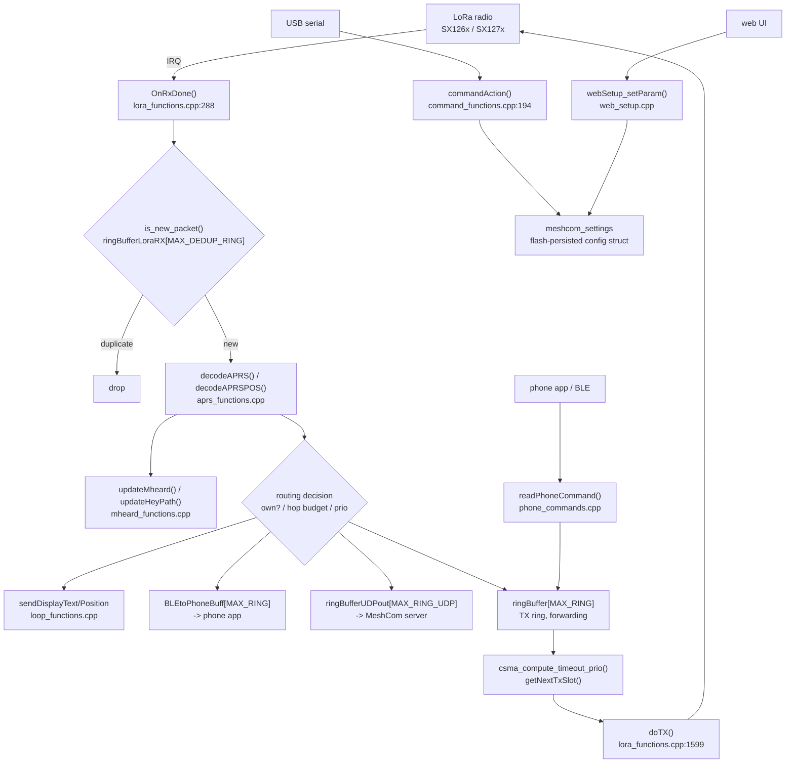

# 01 — System Overview

> **Is this spaghetti code, or is there a core with modules hanging off it?**

## Short answer

Neither, exactly. It is **procedural firmware with an implicit architecture and a global
variable bus**.

There _is_ a recognisable kernel — a clean, traceable packet pipeline that any new
contributor can follow end to end in an afternoon. That is more than most hobby-grown
firmware achieves and it is the reason the project still moves at 935 commits per year.

But there are **no enforced module boundaries anywhere**. Files are not components: they
communicate through 423 `extern` globals, 260 of which live in a single header that almost
every translation unit includes. Hardware variance is handled by 1,131 `BOARD_*` macro
references scattered through application logic rather than by a hardware abstraction layer.

So the failure mode is not "you cannot understand any of it". It is **"any change can
touch anything, and nothing tells you which boards you just broke."** That is the actual
maintenance cost, and it is why the complexity feels gigantic relative to the ~71k lines
of own code.

## The kernel that does exist

The LoRa packet pipeline is the real architecture. It is consistent across MCU families:

Everything else — sensors, displays, GPS, battery, web UI — hangs off `esp32loop()` /
`nrf52loop()` as periodic polling blocks guarded by `millis()` deltas.

## Layer map

The tree _looks_ layered. Read it as intent, not as enforcement — every layer below
reaches upward and sideways through globals.

| Layer                | Location                                                                                         | Notes                                                                       |
| -------------------- | ------------------------------------------------------------------------------------------------ | --------------------------------------------------------------------------- |
| Entry point          | `src/main.cpp` (70 lines)                                                                        | Thin. `#ifdef`-dispatches to `esp32setup/loop` or `nrf52setup/loop`.        |
| MCU / scheduler      | `src/esp32/esp32_main.cpp`, `src/nrf52/nrf52_main.cpp`                                           | The real `loop()`. **Duplicated between the two MCU families.**             |
| Radio                | `src/lora_functions.cpp`, `src/lora_setchip.cpp`                                                 | RX/TX state machine, CAD, CSMA, retransmission, per-region chip setup.      |
| Wire format          | `src/aprs_functions.cpp`, `src/aprs_structures.h`                                                | APRS encode/decode. The interop contract with the live network.             |
| Application services | `src/loop_functions.cpp`, `mheard_functions.cpp`, `via_functions.cpp`                            | Position, telemetry, messaging, neighbour table, display formatting.        |
| Config surface       | `src/command_functions.cpp`, `phone_commands.cpp`, `web_functions/`                              | 218 `--command` arms, BLE command channel, web setup forms.                 |
| Transport (backhaul) | `src/udp_functions.cpp`, `extudp_functions.cpp`, `nrf52/nrf_eth.cpp`                             | WiFi/Ethernet uplink to the MeshCom server.                                 |
| Sensors / IO         | `src/{aht20,bme680,bmp390,bmx280,sht21,mcu811,ina226,onewire,adc,io,rtc,gps,batt}_functions.cpp` | Mostly self-contained. The healthiest part of the tree.                     |
| Display / UI         | `src/Displays/`, `src/t-deck/`, `src/t-deck-pro/`, `src/t5-epaper/`, `src/GFX_Root/`             | **Four independent UI stacks**, ~24k lines, heavy mutual duplication.       |
| Board config         | `variants/<board>/configuration.h` + `platformio.ini`                                            | Pins, board macros, per-board lib pins. See [02](02-build-and-variants.md). |
| Bootloader app       | `src/safeboot/`                                                                                  | Separate firmware image, separate toolchain. See [03](03-dependencies.md).  |

## What breaks the "core + modules" claim

### 1. The global variable bus

`src/loop_functions_extern.h` declares **260 externs**; 423 across all of `src/`.

| Type                | Count |
| ------------------- | ----- |
| `bool`              | 87    |
| `unsigned long/int` | 43    |
| `int`               | 37    |
| `float`             | 18    |
| `String`            | 12    |
| `char[]`            | 11    |
| `uint8_t`           | 10    |
| `double`            | 10    |
| `std::atomic<*>`    | 12    |
| others              | ~13   |

This is the integration mechanism of the entire firmware. There is no interface, no
dependency injection, no ports/adapters, no opaque handle. `bGPSON`, `bDisplayOff`,
`bmx_found`, `posinfo_timer`, `ringBuffer[][]` are all directly readable and writable from
any file that includes the header — which is nearly all of them.

Practical consequences:

- **No unit can be tested in isolation.** Linking one `.cpp` pulls in the whole graph.
- **No compiler help on coupling.** Adding a global is free; nothing reports the fan-in.
- **Concurrency correctness is manual.** Only 12 of 423 globals are `std::atomic`; there
  is one `portMUX_TYPE` (`displayMux`), one mutex (`net_console.cpp`), one queue
  (`bleQueue`, 5 slots). Several past audits in `docs/code-audit-*.md` are follow-ups to
  exactly this.

  **Corrected 2026-07-31:** an earlier version of this bullet said the state is shared
  "between the NimBLE task, the radio ISR callback and the main loop". **There is no radio
  ISR callback** — see the correction box in §3. The accurate picture, and the reason it
  matters, is that the exposure is asymmetric: on ESP32 the LoRa path is single-context, so
  **14 objects are over-synchronised** (two of them, `scanFlag` and `ch_util_rx_start`, are
  dead), while the genuine races are concentrated on nRF52, where the radio task preempts
  `loop()`. Full ownership map and the 9 real races: [08 §2](08-defect-catalogue.md#2-live-defects--new-findings),
  findings `N-13` … `N-16`.

### 2. `#ifdef` instead of a HAL

1,131 `BOARD_*` references in `src/`. 32 distinct board macros appear inside preprocessor
conditionals. Preprocessor branch density per file:

| File                        | `#if/#ifdef/#else/#endif` |
| --------------------------- | ------------------------- |
| `src/esp32/esp32_main.cpp`  | 404                       |
| `src/loop_functions.cpp`    | 294                       |
| `src/command_functions.cpp` | 206                       |
| `src/nrf52/nrf52_main.cpp`  | 114                       |
| `src/lora_functions.cpp`    | 110                       |
| `src/gps_functions.cpp`     | 103                       |

`esp32setup()` alone contains **107 preprocessor branches in 1,129 lines**. Board
differences are resolved inline, in application code, at compile time. There is no board
descriptor struct, no driver vtable, no per-board init table.

Effect: the code you read is never the code that ships. Reasoning about `loop_functions.cpp`
requires holding a board selection in your head, and 29 build environments means 29
different programs are being maintained in one file.

> **CORRECTED 2026-07-31 — this section's headline claim is withdrawn.** The "~3,200 lines"
> figure is `1947 + 1233`, the two loop _sizes_, not a duplication measurement. Measured
> overlap is **~221–268 lines (≈15 %)** in 9 blocks, and **none of the shared blocks is radio
> code** — they are deferred display text, NTP/RTC parsing, the position beacon and sensor
> polling, all already radio-independent. The real blocker is a differing **concurrency
> model**, not a differing API: on ESP32 `OnRxDone` runs in `loopTask` (`checkRX` at
> `esp32_main.cpp:3778`, called from `esp32loop()` at `:2217`); on nRF52 it runs in the
> FreeRTOS **timer service task** at priority 2 (not the SX126x `"LORA"` task — that runs at
> priority 1, same as `loop()`; see
> [08 C-01](08-defect-catalogue.md#c-01--onrxdone-does-not-run-in-interrupt-context--verified-nrf52-half-corrected-2026-07-31)),
> preempting `loop()` on a 1 KB stack. CAD is synchronous on one side and
> asynchronous on the other. See
> [08 C-02](08-defect-catalogue.md#c-02--the-radio-interface-recommendation-is-10-oversized-and-mis-targeted--verified).
> The cheap, real version is to extract the ~221 radio-independent shared lines into a
> common module.

### 3. No radio abstraction — which forced the scheduler to be cloned

ESP32 uses **RadioLib**; nRF52 uses **SX126x-Arduino**. Neither is wrapped. Both leak
directly into the loop files. Because the scheduler sits above the radio API rather than
above an interface, `esp32loop()` (1,947 lines) and `nrf52loop()` (1,233 lines) had to be
written twice and must now be maintained in parallel — 46 cloned 12-line windows between
`esp32_main.cpp` and `nrf52_main.cpp` confirm it mechanically.

This is the single highest-leverage structural defect in the codebase: one interface
would collapse ~3,200 lines of duplicated scheduling into one implementation and make the
nRF52 path stop lagging the ESP32 path on every feature.

### 4. `String` in the packet path

`docs/codequality-rules.md` states: _"String handling: fixed `char[]` arrays — NEVER
Arduino `String` in hot paths."_

`struct aprsMessage` — the central RX/TX packet struct — contains **7 `String` members**
(`msg_source_path`, `msg_source_call`, `msg_source_last`, `msg_destination_path`,
`msg_destination_call`, `msg_payload`, `msg_gateway_call`). `struct mheardLine` contains 7
more, and there are `MAX_MHEARD` of them (up to 80 on some boards). Every received packet
therefore heap-allocates and fragments.

The project's own rules and the project's own core data structure contradict each other.
This is worth recording as a known, accepted debt rather than pretending it is a bug — but
it is the reason the DRAM-tight boards had to drop `MAX_MHEARD` to 10.

### 5. Layering violations in both directions

- Display rendering lives in `loop_functions.cpp` (`sendDisplayText` 466 lines,
  `sendDisplay1306` 321, `sendDisplayPosition` 312) — application logic and presentation
  in one file.
- Radio scheduling lives in `esp32loop()` — transport concerns inside the scheduler.
- `mheard_functions.cpp` shares 19 cloned windows with `t-deck-pro/ui_deckpro.cpp` —
  neighbour-table logic reimplemented inside a UI file.
- `udp_functions.cpp` and `nrf52/nrf_eth.cpp` share 19 cloned windows — the same UDP
  protocol handling, forked per MCU.

## Verdict

| Question                                   | Answer                                                                   |
| ------------------------------------------ | ------------------------------------------------------------------------ |
| Is it spaghetti?                           | No. The packet pipeline is coherent and followable.                      |
| Is there a core?                           | Yes: `lora_functions` + `aprs_functions` + `loop_functions`.             |
| Are there modules?                         | There are **files**. Not modules — no boundaries, no interfaces.         |
| Why does it feel unmanageable?             | Global bus + `#ifdef` HAL + zero tests = no locality of change.          |
| Is the complexity essential or accidental? | ~30 real boards is essential. Handling them with `#ifdef` is accidental. |

The three structural changes that would matter most, in order of leverage:

1. **A radio interface** — collapses the duplicated ESP32/nRF52 scheduler (~3,200 lines).
2. **A board descriptor** — moves `#ifdef BOARD_*` out of application code into `variants/`.
3. **A command table** — replaces the 4,916-line `commandAction()` if-chain (218 arms).

None of these requires a rewrite. See [05 — Rewrite vs. Refactor](05-rewrite-vs-refactor.md).
