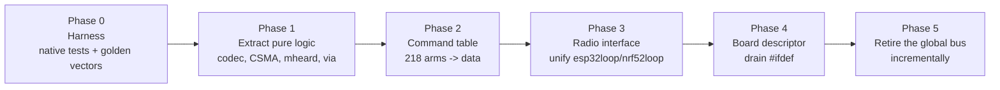

# 05 — Rewrite vs. Refactor

> **Would a 1:1 port make sense — rewrite everything, then use unit / integration /
> regression tests to compare before and after?**

## Recommendation

**No. Not as a 1:1 port.**

But the instinct behind the question is right, and the most valuable half of the proposal
should be done immediately and on its own: **build the test harness first.**

Here is the decisive asymmetry. The plan is "rewrite, then prove equivalence with tests".
Those tests have to exist _before_ the rewrite can be validated — you cannot compare
before/after without an oracle that runs against _before_. So the first work item in the
rewrite plan is identical to the first work item in the refactor plan.

The difference is what happens once that harness exists:

- With a harness, **incremental restructuring becomes safe**, cheap, and shippable in
  small pieces — each one mergeable upstream.
- With a harness, **the rewrite becomes unnecessary**, because you can now attack
  `commandAction()`, the duplicated scheduler and the global bus one at a time without
  guessing.

Build the harness. Then re-ask the question. The honest prediction is that you will not
want the rewrite any more, because 80% of the pain will be gone for 10% of the cost.

## Why a 1:1 port specifically fails here

### 1. There is no specification to port against — the code _is_ the spec

A 1:1 port assumes you know what "1:1" means. Here, the observable behaviour includes:

- 218 `--command` arms with hand-computed argument offsets, undocumented ordering
  dependencies, and per-board behaviour
- an on-air wire format defined only by `decodeAPRS()` / `decodeAPRSPOS()` /
  `PositionToAPRS()` — including which malformed frames are tolerated
- CSMA/CAD timing (`CSMA_SLOT_SIZE 35`, priority slots, backoff) tuned empirically against
  a live network
- 30 boards' worth of pin maps, power sequencing and display quirks
- a half-finished battery migration with two live implementations
  ([04](04-complexity-and-duplication.md))

None of this is written down independently of the source. A rewrite would not be porting a
design; it would be re-deriving undocumented behaviour from 71k lines of `#ifdef`-laden C++
and hoping nothing subtle was load-bearing. In firmware that talks to peers in the field,
the subtle things always are.

### 2. "1:1" is unverifiable without the hardware

Equivalence would have to hold on ~30 board variants. Nobody has 30 boards. The parts you
_can_ test on a desktop — codec, routing, timing math, command parsing — are exactly the
parts that a **strangler refactor also lets you test**, without rewriting the 24k lines of
display code or the 12.6k lines of MCU bring-up that you cannot test either way.

So the rewrite pays full price for the untestable 60% of the codebase and gains nothing
there.

### 3. The network is live, heterogeneous, and the old code is the reference

MeshCom nodes running v4.x are deployed and interoperating right now. A rewritten node
must be bit-compatible with them — and the only authoritative description of that
compatibility is the implementation you would be deleting. Any divergence shows up as
"some nodes can't hear each other", reported weeks later, from the field, without a
reproducer.

### 4. Upstream does not stop

935 commits in the last 12 months, 24 contributors, `SOURCE_VERSION` at 4.35. This
repository's own rule (`CLAUDE.md`) is: _sync upstream first, cherry-pick the absolute
minimum, no large refactors._

A rewrite is structurally unmergeable under that rule. It would live on a fork, chase a
moving target for its entire lifetime, and face a merge decision at the end that no
maintainer can reasonably approve — because reviewing it means reviewing 71k lines against
a codebase that has moved another ~900 commits in the meantime.

### 5. The second-system trap is unusually strong here

The complexity that looks accidental from the outside is often a fix. `#if defined(BOARD_E213)`
in the middle of display code usually means a real panel behaves differently. The comment
`platform = espressif32 @ 6.6.0 ;https://github.com/Bodmer/TFT_eSPI/issues/3332` is three
days of someone's life compressed into one line. A rewrite discards all of it and
rediscovers it board by board, in the field.

## What to do instead: strangle, don't replace

Same destination, delivered incrementally, each step independently valuable and upstream-able.

### Phase 0 — Harness (do this regardless of what you decide)

The whole content of [06 — Test Strategy](06-test-strategy.md). Native PlatformIO test
environment, golden on-air vectors captured from real traffic, byte-exact codec assertions.

**This is the "before/after 1:1 comparison" tool you were asking for.** It just gets built
first and used continuously, instead of being built at the end to bless a rewrite.

### Phase 1 — Extract the portable core

`aprs_functions.cpp`, `via_functions.cpp`, `mheard_functions.cpp`, `regex_functions.cpp`,
the CSMA math in `lora_functions.cpp` and `test/compress_functions.cpp` are almost pure
logic. What stops them compiling on a desktop is `#include <configuration.h>` and the
global bus — not the algorithms.

Move them behind a thin seam, compile them natively, and pin them with the golden vectors.
That gets you a regression suite for the interop contract, which is the highest-risk
surface in the whole system.

### Phase 2 — Command table

`commandAction()` → `struct Command { name, argc, handler }`. See
[04](04-complexity-and-duplication.md). ~4,900 lines of branching become data plus 218
small functions, each unit-testable. This is mechanical, reviewable in slices (e.g. 20
commands per PR), and immediately reduces the `#ifdef` load in `command_functions.cpp`.

### Phase 3 — Radio interface

One interface with `begin/setChip/startRx/transmit/cad/onRxDone/onTxDone`. RadioLib behind
one implementation, SX126x-Arduino behind another. Then `esp32loop()` and `nrf52loop()`
collapse into a single scheduler.

This is the biggest single win in the codebase: ~3,200 lines of duplicated scheduling gone,
and the nRF52 boards stop lagging the ESP32 boards on every feature.

It is also the riskiest step, which is exactly why Phase 0 has to come first.

### Phase 4 — Board descriptor

Replace `#if defined(BOARD_*)` in application code with a per-board `const` struct in
`variants/` (pins, display driver, PMU, radio chip, capability flags). Application code
reads fields instead of branching at compile time. `esp32setup()`'s 107 preprocessor
branches become a table walk.

### Phase 5 — Retire the global bus

Not a big bang. Group related externs into structs (`RadioState`, `DisplayState`,
`NodeConfig`, `SensorState`), give them accessors, and move files onto the accessors one
at a time. Each move is small, mechanical, and shrinks the coupling surface measurably.

## Cost comparison

Rough, deliberately conservative. "Sessions" = focused working sessions, not calendar time.

| Approach                | Effort                | Ships value at  | Upstream-able      | Risk of silent field breakage                |
| ----------------------- | --------------------- | --------------- | ------------------ | -------------------------------------------- |
| **1:1 rewrite**         | multiple person-years | only at the end | effectively no     | very high — no oracle for the untestable 60% |
| **Phase 0** (harness)   | ~5–10 sessions        | immediately     | yes                | none (adds tests only)                       |
| **Phase 1** (extract)   | ~10–15 sessions       | per module      | yes                | low                                          |
| **Phase 2** (commands)  | ~10–15 sessions       | per PR slice    | yes                | low–medium                                   |
| **Phase 3** (radio HAL) | ~20–30 sessions       | at completion   | yes, as one series | medium–high, but instrumented                |
| **Phase 4** (boards)    | ~20–30 sessions       | per board group | yes                | medium                                       |
| **Phase 5** (globals)   | ongoing               | continuously    | yes                | low                                          |

Phases 0–2 alone address the three things that actually hurt today: no test oracle, an
unmaintainable command surface, and no way to verify a dependency bump. They cost a small
fraction of a rewrite and every step is shippable.

## When a rewrite _would_ be the right call

For completeness, the conditions that would change this answer:

- The wire format is being replaced anyway (breaking change to the protocol, coordinated
  fleet-wide). Then there is no interop contract to preserve and the main argument
  collapses.
- The board matrix is being cut to 3–5 supported boards. Most of the essential complexity
  is the board count.
- The project leaves the Arduino framework for ESP-IDF/Zephyr outright. That is a rewrite
  by force, not by choice.
- Upstream stops moving and this repo becomes the maintained line.

None of these is true today. Revisit if one becomes true.

## Bottom line

The proposal contains one excellent idea (build a before/after regression oracle) attached
to one bad one (rewrite everything first). Keep the first, drop the second, and the good
idea starts paying off in weeks instead of years.
