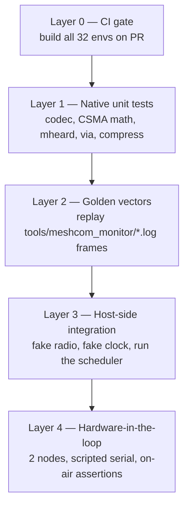

# 06 — Test Strategy

> **How do we get an oracle that makes before/after comparison possible?**

This document covers **which layers to build and why**. The concrete build-out — the
instrumentation that already exists, the test hooks to add, the physical two-node bench,
and the scenario catalogue — is in
[07 — Verification Infrastructure](07-verification-infrastructure.md).

## Current state

**There are no automated tests.** Not "few" — zero.

- `test/` contains `compress_functions.cpp/.h` and
  `test_invariant_TinyGsmClientSequansMonarch.h`. These are source files parked in the
  test directory, not tests. `pio test` has nothing to run.
- No `platform = native` environment exists in any `platformio.ini`.
- No test framework (Unity, GoogleTest, Catch2) is referenced anywhere.
- `.github/workflows/meshcom-ci.yml` triggers on `push: tags: '*'` only, and does a build,
  not a test. There is no PR gate.

Every claim of correctness in this project currently rests on flashing hardware and
watching. That works — the audits in `docs/code-audit-*.md` are evidence of real diligence
— but it does not scale to 30 boards, 24 contributors, and a dependency backlog
([03](03-dependencies.md)) that needs verifying.

## What already exists that helps

> **CORRECTED 2026-07-31 — asset 1 below does not exist.** Measured across all 17 logs:
> 1,821 hex dumps, 25,645 decode lines, **0 usable pairs**. Every hex dump is emitted at
> `esp32_main.cpp:3811-3821`, inside the `RADIOLIB_ERR_CRC_MISMATCH` branch that returns
> **before** `OnRxDone()` and therefore before `decodeAPRS()` — a frame can never be both
> dumped and decoded. The worked example below splices a CRC-failed dump onto a decode line
> recorded 109 seconds later from a different frame. Even with correct pairs the oracle
> would be circular, since `MH-LoRa:` is printed by the very decoder under test.
> See [08 C-03](08-defect-catalogue.md#c-03--the-golden-vector-corpus-does-not-exist--verified)
> and [08 §4](08-defect-catalogue.md#4-what-replaces-the-golden-vector-plan) for what
> replaces Layer 2. The text is kept below as written so the error is traceable.

Two assets are worth more than they look:

1. ~~**`tools/meshcom_monitor/*.log` — 17 captured sessions with raw frame hex.**~~
   _(withdrawn — see the correction above)_
   Real on-air traffic, timestamped, with the decoded interpretation alongside:

   ```
   17:24:32.263  00:00:21 MH-LoRa: 062 @ x91A4354E H02 S0 T0 M01
                 DK5EN-98,DB0ED-99,DL2JA-2>H@R0;119,-11;19,91,4;
                 HW:09 MOD:8/8 FCS:0D21 FW:35:p LH:AB
   ```

   ```
   21 50 35 A4 91 91 44 4B 35 45 4E 2D 39 38 2C 44 4C 37 4F 53 58 2D 31 3E 2A 21 …
   ```

   **This is a golden-vector corpus you already own.** Input bytes plus the expected
   decode, captured from the live network, including the awkward cases.

2. **`tools/` instrumentation** — `ram_snapshot.py`, `code_audit_scan.py`,
   `loganalyse.sh`, `serial_monitor.py`, plus the `/ram-snapshot`, `/code-audit` and
   `/logauswertung` skills. The measurement culture is there; the automated-assertion
   layer is not.

## The plan

Four layers, in dependency order. Layer 1 is worth building even if nothing else follows.



### Layer 0 — CI gate (do first, costs nothing)

```yaml
on:
  pull_request:
  push:
    branches: ["**"]
    tags: ["*"]
```

Plus a matrix over the 32 environments so a failure names the board. With `#ifdef`-driven
variance, "it builds on my board" is currently the only signal anyone has; this makes it
30 signals.

Add `-Werror` for a curated warning subset later, not immediately — `-Wall -Wextra` is
already on and the existing warning volume should be measured before it becomes blocking.

### Layer 1 — Native unit tests

Add a native environment:

```ini
[env:native-test]
platform = native
test_framework = unity
build_flags =
    -std=gnu++17
    -DUNIT_TEST
    -DNATIVE_BUILD
    -I test/support        ; Arduino.h / String shims
    -I src
build_src_filter = -<*>    ; tests pull in only what they need
```

**The blocker is not the algorithms — it is `#include <configuration.h>` and
`loop_functions_extern.h`.** Every candidate file pulls in the global bus and the Arduino
runtime. Two options, use both:

- **Shim layer** (`test/support/Arduino.h`, a minimal `String`, `millis()` fake): cheap,
  ugly, unlocks a lot immediately. Arduino `String` is well-defined enough to stub for the
  subset the codec uses.
- **Seam extraction**: split the pure logic out of the file that owns it. E.g. move
  `csma_compute_timeout()` / `csma_compute_timeout_prio()` / `getNextTxSlot()` out of
  `lora_functions.cpp` into `lora_csma.cpp` with no Arduino dependency. Cleaner, and it is
  Phase 1 of [05](05-rewrite-vs-refactor.md) anyway.

**First five test targets**, ranked by risk × testability:

| #   | Target                                                        | Why first                                                                |
| --- | ------------------------------------------------------------- | ------------------------------------------------------------------------ |
| 1   | `decodeAPRS()` / `decodeAPRSPOS()` — `aprs_functions.cpp`     | The interop contract. Highest consequence, pure input→output.            |
| 2   | `PositionToAPRS()` — `loop_functions.cpp:3266`                | The encode side. Round-trip with #1.                                     |
| 3   | `csma_compute_timeout_prio()`, `getNextTxSlot()`              | Timing math; regressions here are invisible until the channel collapses. |
| 4   | `updateMheard()` / `updateHeyPath()` — `mheard_functions.cpp` | Ring-buffer index arithmetic, `MAX_MHEARD` varies per board.             |
| 5   | `commandCheck()` + a handful of `commandAction` arms          | Enables the Phase 2 dispatch-table refactor safely.                      |

Then: `via_functions.cpp`, `regex_functions.cpp`, `test/compress_functions.cpp`,
`conv_fuss`/`conv_meter`/`cround4`, `shortVERSION()`, `convertCallToShort()`.

### Layer 2 — Golden vectors from real traffic

This is the "1:1 before/after comparison" mechanism.

**Build step:**

1. Write `tools/extract_vectors.py`: parse `tools/meshcom_monitor/*.log`, pair each raw
   hex dump with the `MH-LoRa:` decode line that follows it, emit
   `test/vectors/rx_<n>.json`:

   ```json
   {
     "source": "meshcom_2026-03-22_172422.log:412",
     "raw_hex": "21 50 35 A4 91 91 44 4B ...",
     "len": 122,
     "expect": {
       "msg_source_call": "DL7OSX-1",
       "msg_source_path": "DK5EN-98",
       "payload_type": "!",
       "max_hop": 2,
       "msg_fcs": "0D21",
       "lat": 48.4072,
       "lon": 11.74,
       "alt": 1657
     }
   }
   ```

   Note: the hex dumps run past the packet — they are `RcvBuffer` prints that include
   stale bytes beyond `msg_len`. The extractor must honour the length field, and the test
   should assert the decoder does too. That is a useful assertion in its own right.

2. A Unity test iterates every vector, calls `decodeAPRS()`, asserts field-by-field.

3. A second test round-trips: decode → re-encode → assert byte-identical.

**Then the oracle exists.** Any refactor, any dependency bump, any rewrite of any size can
be checked against real traffic in under a second, on a laptop, with no hardware.

Grow the corpus deliberately: add a vector for every bug ever fixed in the decoder
(`docs/code-audit-*.md` is the backlog), and every malformed frame seen in the field.

### Layer 3 — Host-side integration

With the codec pinned, fake the two things the scheduler depends on:

- **`FakeRadio`** implementing the radio interface from Phase 3 of
  [05](05-rewrite-vs-refactor.md): scriptable RX injection, TX capture, CAD results on
  demand.
- **`FakeClock`** replacing `millis()`, so a 15-minute telemetry interval is 15
  microseconds of test time.

Then you can assert behaviour that currently needs two nodes and an afternoon:

- a duplicate `msg_id` arriving twice is forwarded once (`MAX_DEDUP_RING` wraparound
  included — `configuration_global.h` records that wraparounds were observed in the field)
- hop budget: `max_hop` decrements, a frame at 0 is dropped
- retransmission fires after the ACK window and stops after the retry limit
- priority ordering: `getNextTxSlot()` picks the high-priority slot under contention
- CSMA backoff grows as specified and the channel does not livelock
- ring overflow under load drops the oldest, not the newest, and does not corrupt indices

That list is precisely the set of things that have generated audit findings before.

### Layer 4 — Hardware-in-the-loop

Two nodes on a bench, driven over serial by `tools/serial_monitor.py`, asserting on the
log lines that already exist (`[MC-SM]`, `[MC-DBG]`, `MH-LoRa:`). Nightly, not per-PR.

Scope: RF timing, real CAD behaviour, BLE pairing matrix, battery curves, deep-sleep
wake. Everything the desktop cannot fake. Keep it small — this is the expensive layer, so
it should only cover what genuinely needs radio.

Two things determine whether this layer produces findings or impressions, and both are
covered in [07](07-verification-infrastructure.md): the bench must be **wired and
off-frequency** (otherwise you measure the live mesh, not your change), and CSMA must be
made **reproducible** (`random()` currently draws from the hardware TRNG, so timings never
repeat). There is also a middle option worth building before Layer 4: an `--inject <hex>`
test hook moves scenarios that look like they need two radios onto a single board with no
radio at all.

## Regression discipline

Per the project's own rules, and worth restating because there is currently no mechanism
to enforce them:

- **Every bug fix gets a test that fails before and passes after.** With Layer 2 in place
  this is usually one JSON vector.
- **A green suite is not proof of correctness.** Audit the suite itself before trusting it
  as a ship signal.
- **A verdict from a broken instrument is void.** If the runner emits harness errors, fix
  the runner and re-verify — do not read through the noise.

## Effort

| Layer                                     | Effort          | Unblocks                                           |
| ----------------------------------------- | --------------- | -------------------------------------------------- |
| 0 — CI gate                               | ~1 session      | catching board breakage at PR time                 |
| 1 — native env + shims + 5 targets        | ~5–8 sessions   | any refactor of the pure logic                     |
| 2 — vector extractor + corpus             | ~3–5 sessions   | **the before/after oracle**; safe dependency bumps |
| 3 — FakeRadio/FakeClock + scheduler tests | ~10–15 sessions | radio interface work, `OnRxDone()` split           |
| 4 — hardware-in-the-loop                  | ~10+ sessions   | RF/BLE/power verification                          |

Layers 0–2 are roughly 10 focused sessions and deliver the single thing this codebase is
missing most: **a way to know whether a change broke anything, before it reaches the air.**

## First concrete step

Layer 0 is one file. Layer 2's extractor runs against logs that are already in the repo.
Neither needs a design decision, hardware, or upstream coordination — and Layer 2 is
exactly the "1:1 before/after comparison" tool that motivated the rewrite question in
[05](05-rewrite-vs-refactor.md).

For the ordered build-out across all layers, including the no-hardware steps that should
precede any bench work, see
[07 §10 — Build-out order](07-verification-infrastructure.md#10-build-out-order).
