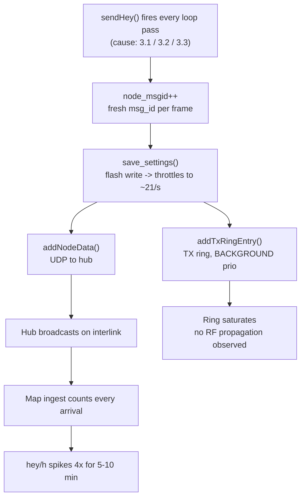

# HEY Storms -- Root-Cause Analysis (2026-08-27)

Investigation of the recurring `hey/h` spikes visible on the MeshCom Map admin
dashboard (`meshmap.oevsv.at/admin`, "Flottenaktivitaet" chart). Data source:
`mcmap-prod` MCP -- `activity_series` (48 h) plus regex scans of the raw
`interlink` log (live file 2026-08-26 22:53 UTC onwards, ~97 MB, and the
2026-08-25 / 2026-08-26 gzip archives).

Related: [hey-supp.md](hey-supp.md) (Trickle-HEY suppression measurement).

---

## 1. Result at a glance

**A HEY storm is not a network phenomenon. It is one single station going into a
runaway HEY loop for 5-10 minutes at ~21 frames/second.** In both spikes that
were traced to the frame level, a single callsign produced about two thirds of
all HEY frames in that hour.

| Spike (CEST)  | hey/h  | Culprit      | Its share         | Rate  | Burst window      |
| ------------- | ------ | ------------ | ----------------- | ----- | ----------------- |
| 27 Aug, 13:00 | 16 751 | **DN9SE-12** | 12 406 (**67 %**) | ~21/s | 13:07 - ~13:17    |
| 27 Aug, 09:00 | 12 657 | **DH4NBB-1** | 8 195 (**65 %**)  | ~21/s | 09:02:51 - ~09:09 |

Culprit share is counted against the interlink log's own hour total (18 563
frames for the 13:00 hour); the `hey/h` column is the map's counter, which is
marginally lower.

Normal baseline over the same 48 h: **3 646 - 4 648 hey/h**.

### The nodes

| Callsign | Hardware    | Firmware  | Role        | Location                                   |
| -------- | ----------- | --------- | ----------- | ------------------------------------------ |
| DN9SE-12 | HELTEC V3   | **4.35p** | non-gateway | 50.8295 / 8.0357                           |
| DH4NBB-1 | HELTEC E290 | **4.35o** | gateway     | 49.5255 / 10.493, JN59FM "MeshCom Ipsheim" |

Both are isolated, one-off events: DH4NBB-1 sent 34 HEY in the following 8 h,
DN9SE-12 30 HEY in the preceding 11 h, and the 2026-08-25 archive shows 80
combined -- all normal. **A different station each time.**

---

## 2. What a storm frame looks like

Three consecutive lines from `interlink`, same second:

```json
{"type":"hey","path":"DH4NBB-1","rssi":"","nct":1,"msg_id":"EFCA61F1","gw":1,"timestamp":1787814171}
{"type":"hey","path":"DH4NBB-1","rssi":"","nct":1,"msg_id":"EFCA61F2","gw":1,"timestamp":1787814171}
{"type":"hey","path":"DH4NBB-1","rssi":"","nct":1,"msg_id":"EFCA61F3","gw":1,"timestamp":1787814171}
```

Three properties settle what these are:

1. **`msg_id` increments by exactly 1 per frame.** That is
   `meshcom_settings.node_msgid++` (`src/loop_functions.cpp:4244`) feeding
   `msg_id = ((_GW_ID & 0x3FFFFF) << 10) | (node_msgid & 0x3FF)`
   (`src/loop_functions.cpp:4231`). Every frame is a **fresh `sendHey()` call**,
   not a duplicated report of one transmission. Verified: 269 frames sampled
   from DN9SE-12 -> 269 distinct `msg_id`, contiguous.
2. **0-hop path, empty `rssi`.** The interlink parser classifies this as
   "1-element src -- gateway self-report, no RF reception described". The frames
   arrive over the node's internet uplink, not as a neighbour's RF report.
3. **~21 frames/second is beyond LoRa airtime.** Measured per-second counts
   during DH4NBB-1's burst: 5, 21, 23, 25, 24, 19, 25, 25, 23, 22, 23, 23, 25,
   25, 21, 24, 5. No SF/BW combination in use transmits 25 frames/s, so the RF
   channel is not what carries this volume -- the hub and the map are.

### It is the HEY path only

Same node, same hour, other frame types:

| Node     | HEY in window | `pos` in same window | `tlm` |
| -------- | ------------- | -------------------- | ----- |
| DH4NBB-1 | 8 195 (1 h)   | 31                   | none  |
| DN9SE-12 | 12 406 (1 h)  | 53 (over 8 h)        | none  |

Network-wide `tlm/h` stayed at 9-22 and `pos/h` flat at ~3 900-4 200 straight
through every spike. **Whatever trips, it sits in the periodic HEY scheduler,
not in the shared timer machinery.** This is the single most useful constraint
for root-causing, and it rules out the simplest explanations (see below).

---

## 3. Candidate root causes, ranked

All line references are against upstream merge-base `8114d7ae`
(`icssw-org/MeshCom-Firmware` DEV, v4.35p) unless stated.

### 3.1 External `--sendhey` trigger -- best fit

`src/command_functions.cpp:3258` exposes `--sendhey`, which calls `sendHey()`
directly. A phone app, a script, or a serial/telnet bridge calling it in a loop
reproduces every observed property:

- HEY only, nothing else -- no other frame type shares that entry point.
- ~21/s exactly matches the rate limit imposed by `save_settings()`
  (`src/loop_functions.cpp:4249`), a flash write executed once per `sendHey()`.
- Abrupt start and abrupt stop, one station at a time, no recurrence.

Cannot be confirmed or refuted from server-side data. Requires the node's own
console log or a question to the operator.

### 3.2 32-bit overflow in the HEY timer

`src/esp32/esp32_main.cpp:3162`:

```c
if (((heyinfo_timer + trickle_interval_ms + extra_hey_time) < millis()) || (bHeyFirst && bAllStarted))
```

The `timer + interval < millis()` form latches permanently true once the sum
wraps 32 bits, i.e. in the last `interval` milliseconds before the ~49.7-day
`millis()` rollover. The block then fires on **every loop pass** and
`heyinfo_timer = millis()` at the end cannot recover it, because the sum
overflows again immediately.

- Arrival rate is right (loop-rate bound, throttled by the flash write).
- Burst length is right (the window is `trickle_interval_ms` = up to 15 min).
- Frequency is plausible: ~1 450 stations / 49.7 d gives ~1.2 rollovers per
  hour fleet-wide; only long-uptime nodes ever reach it.

**Weakness:** `pos` (`:3081`, `:3084`) and `tlm` (`:3215`) use the identical
broken idiom, and both have their post-send timestamps updated the same way --
so they should storm simultaneously. They did not. Overflow alone therefore does
not explain the observed selectivity.

Our branch `v4.35p_prio` already uses the safe form
(`src/esp32/esp32_main.cpp:3188`):

```c
if (((uint32_t)(millis() - heyinfo_timer) >= (trickle_interval_ms + extra_hey_time)) || (bHeyFirst && bAllStarted))
```

Upstream still carries roughly 40 more instances of the unsafe idiom across
`esp32_main.cpp`, `nrf52_main.cpp`, `loop_functions.cpp` and `lora_functions.cpp`.

### 3.3 Trickle interval latching at zero

`src/esp32/esp32_main.cpp:3195`:

```c
trickle_interval_ms = min(trickle_interval_ms * 2, (unsigned long)(TRICKLE_IMAX_S * 1000UL));
```

There is no lower clamp. If `trickle_interval_ms` ever reaches 0 -- through
memory corruption or any path that zeroes it -- then `0 * 2 == 0` keeps it 0
forever, and the guard at `:3162` is satisfied on every loop pass. A permanent,
self-sustaining storm. Worth a defensive floor regardless of whether it fired
here.

**Weakness:** trickle landed upstream on 2026-03-18 (commit `d98e8eff`), after
the 4.35p version bump. DH4NBB-1 runs **4.35o**, which predates it, so this
cannot explain that storm. It remains a live hazard for 4.35p+ only.

### Why 3.2 and 3.3 both fall short

Neither explains both storms _and_ the HEY-only selectivity. 3.1 explains
everything but is unproven. The honest position: the trigger is confirmed to be
repeated `sendHey()` invocation; which of the three drives it is not yet
determined.

---

## 4. Collateral damage per storm

Each storm frame costs the emitting node two expensive operations:

| Operation                            | Location                      | Cost at 21/s over 6.5 min                           |
| ------------------------------------ | ----------------------------- | --------------------------------------------------- |
| `save_settings()` -- NVS/flash write | `src/loop_functions.cpp:4249` | ~8 200 flash writes                                 |
| `addTxRingEntry(..., "auto_pos")`    | `src/loop_functions.cpp:4274` | TX ring saturated with `MSG_PRIO_BACKGROUND` frames |
| `addNodeData()` -- UDP to server     | `src/loop_functions.cpp:4267` | 8 195 frames to the hub (gateways only)             |

Flash wear is the material risk: `sendHey()` performs a settings write on every
single call. The TX ring saturation is bounded by ring capacity, so the RF
channel is protected by physics and backpressure rather than by design -- no
relayed copies of the burst frames appear anywhere in the log, confirming the
storm did not propagate over the air.

---

## 5. Background multiplier (not the spike cause)

The `hey/h` tile counts **reports, not transmissions**. The hub forwards one
report per hearing gateway and the map counts each arrival.

Distinct-`msg_id` ratio in 400-frame samples:

| Window                    | Frames | Distinct `msg_id` | Ratio |
| ------------------------- | ------ | ----------------- | ----- |
| 27 Aug 16:00 CEST (quiet) | 400    | 191               | 2.09x |
| 26 Aug 09:00 CEST         | 400    | 175               | 2.29x |
| 27 Aug 13:00 CEST (spike) | 1 000  | 595               | 1.68x |

The spike sample shows a _lower_ ratio precisely because the storm frames are
all distinct -- further confirmation that storms are fresh transmissions, not
amplified reports.

Multiplicity histogram, quiet hour (frames per distinct `msg_id`):

```
1x:119  2x:26  3x:16  4x:8  5x:10  6x:5  7x:1  8x:1  10x:2  11x:2  12x:1
```

Individual frames reach 12x. Example: `OE3XPA-12` / `72BF2540` delivered 5 times
within one second, identical path and rssi. All arrivals carry
`upstream=oe` -- this is **not** a multi-hub double-feed.

Consequence for reading the dashboard: a baseline of 4 000 hey/h corresponds to
roughly **1 900 real HEY transmissions/h**. Against ~1 450 stations at one HEY
per 15 min (~5 800 expected), most transmissions are never reported at all. The
multiplier is constant across quiet and spike hours and is therefore not what
produces the spikes.

---

## 6. Anatomy



---

## 7. Not established

- **Five of the eight spikes in the 48 h window are untraced.** The sampled
  windows fell outside the burst. Same signature is likely but unconfirmed:
  26 Aug 01:00 (5 958), 03:00 (6 729), 04:00 (5 276), 09:00 (11 383),
  10:00 (15 945); 27 Aug 03:00 (9 044).
- **Which of the three candidate causes actually fired.** Needs node-side
  evidence.
- **Node uptime at storm time.** Would immediately confirm or kill the
  49.7-day-rollover hypothesis (3.2). Not exposed by any current telemetry
  channel.

---

## 8. Recommended actions

| #   | Action                                                                                                      | Where                                        | Priority                                  |
| --- | ----------------------------------------------------------------------------------------------------------- | -------------------------------------------- | ----------------------------------------- |
| 1   | Ask DH4NBB and DN9SE what the node was doing at 09:02 / 13:07 CEST on 2026-08-27                            | --                                           | high, settles 3.1 immediately             |
| 2   | Per-callsign HEY rate guard on map ingest: flag/drop > 60 hey/min from one path                             | mcmap ingest                                 | high, caps the damage regardless of cause |
| 3   | Lower clamp on `trickle_interval_ms` (`max(..., TRICKLE_IMIN_S * 1000UL)`)                                  | `esp32_main.cpp:3195`, `nrf52_main.cpp:1854` | medium, cheap defensive fix               |
| 4   | Rate-limit `sendHey()` itself -- reject calls closer than `TRICKLE_IMIN_S` apart, including via `--sendhey` | `loop_functions.cpp:4217`                    | medium, kills all three causes at once    |
| 5   | Drop `save_settings()` from `sendHey()` or defer it (write `node_msgid` at most once per minute)            | `loop_functions.cpp:4249`                    | medium, flash-wear                        |
| 6   | Port the `millis() - timer >= interval` form to the remaining ~40 upstream call sites                       | upstream DEV                                 | low, hygiene                              |
| 7   | Expose node uptime in telemetry so rollover hypotheses become testable                                      | firmware + map                               | low                                       |

Items 3-6 are candidates for an upstream PR against DEV; per project policy the
PR description must be written in German and target DEV, not main.

---

## Appendix: reproduction

Hour buckets and network totals:

```
mcp__mcmap-prod__activity_series(hours=48)
```

Total HEY in a spike hour (Unix-second prefix regex; note 1787828400 begins
`17878`, whereas 1787792400 begins `17877`):

```
logs_grep(name="interlink", countOnly=true,
          pattern='"type":"hey".*"timestamp":17878(28[4-9]\d\d|29\d{3}|3[01]\d{3})')
```

Culprit's share of that hour:

```
logs_grep(name="interlink", countOnly=true,
          pattern='"path":"DN9SE-12".*"timestamp":17878(28[4-9]\d\d|29\d{3}|3[01]\d{3})')
```

Cross-check that the same node is _not_ storming `pos`:

```
logs_grep(name="interlink", countOnly=true,
          pattern='"src":"DH4NBB-1".*"timestamp":17878(1[4-6]\d{3}|17[0-5]\d\d)')
```

The live `interlink` log exceeds the 50 MiB per-scan bound. A first call returns
`truncated: true` with `truncatedReason: "maxScanBytes"`; pass its `nextCursor`
back verbatim to scan the remainder. Sampled frames are analysed locally with
`jq -r '.matches[].text'` piped through `grep -o '"path":"[^"]*"' | sort | uniq -c | sort -rn`.
