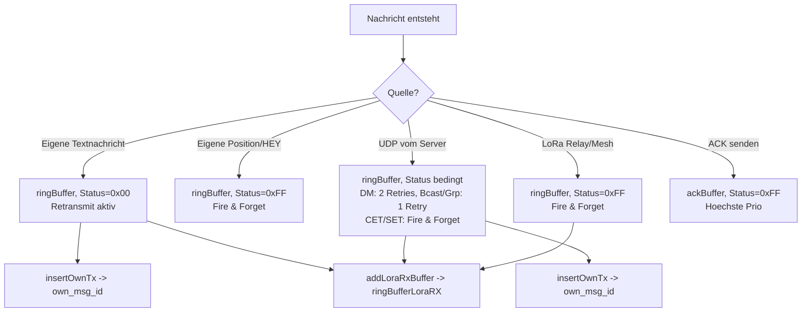
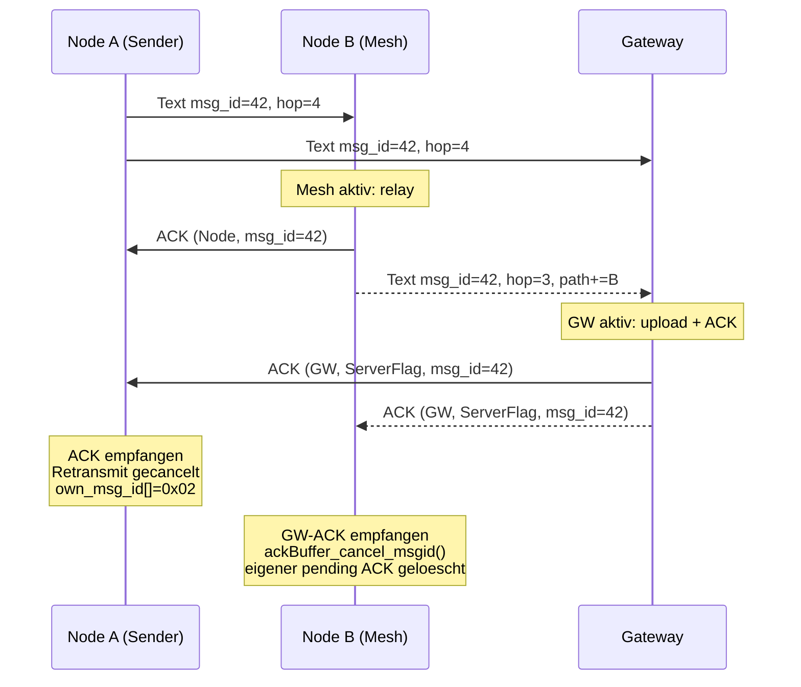
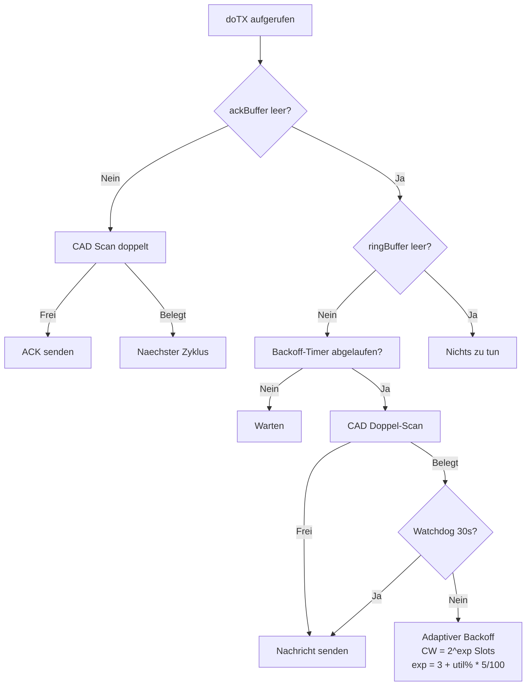
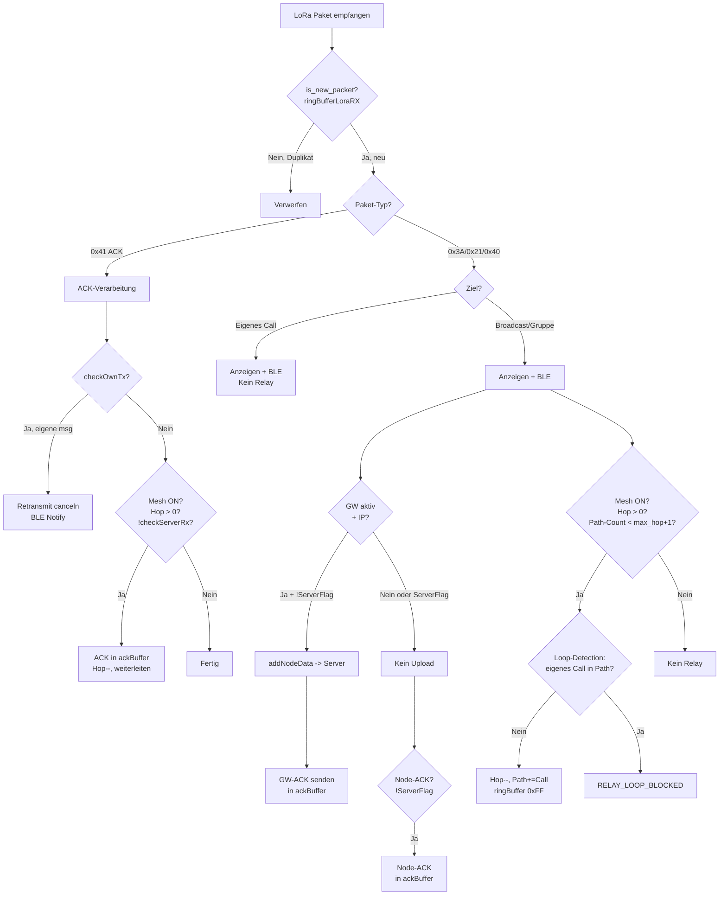
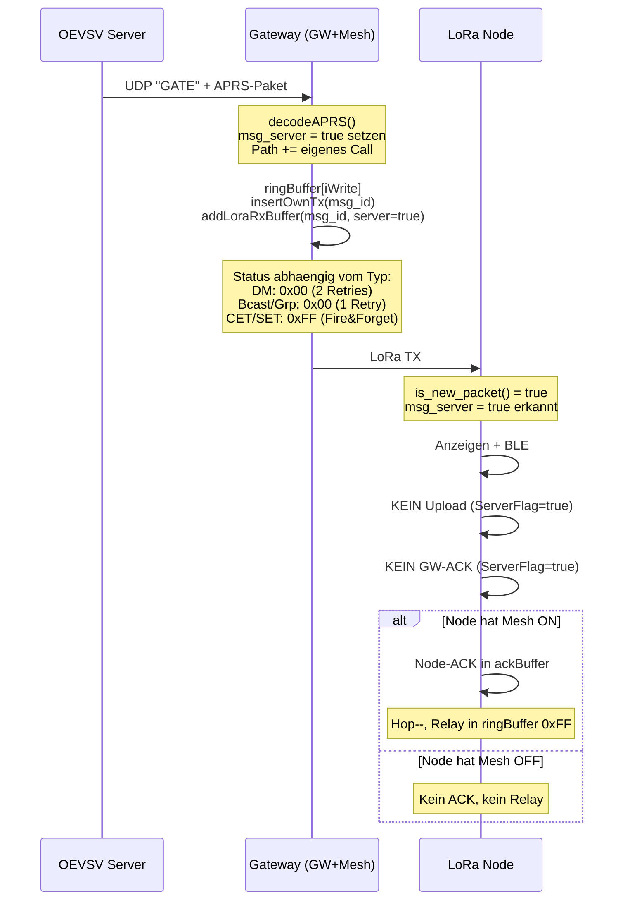
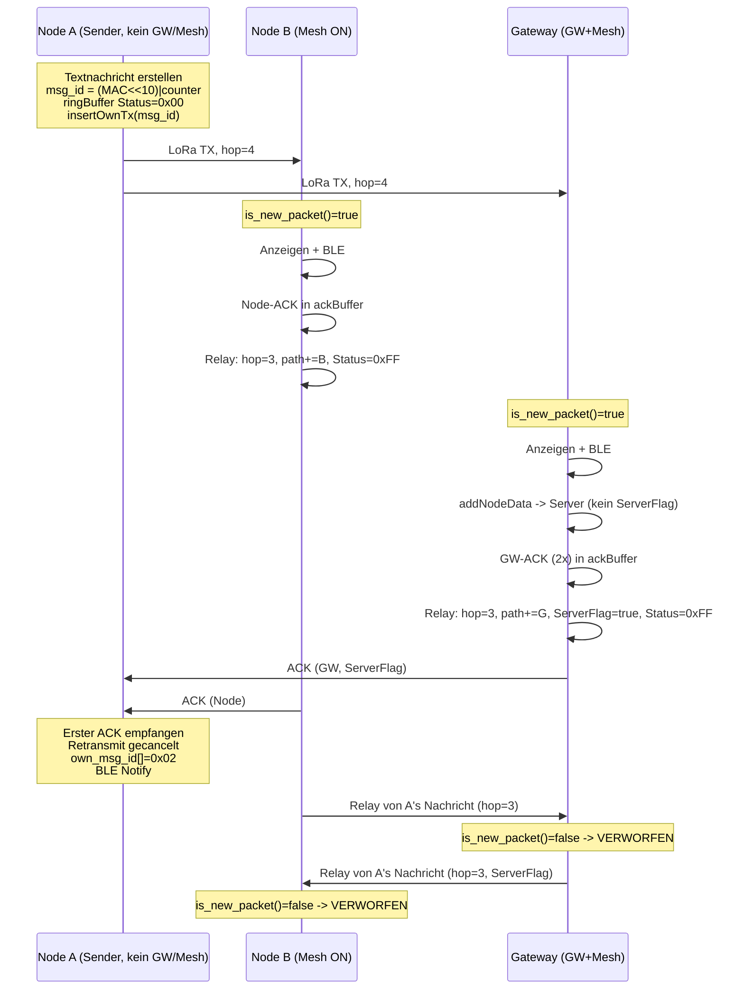
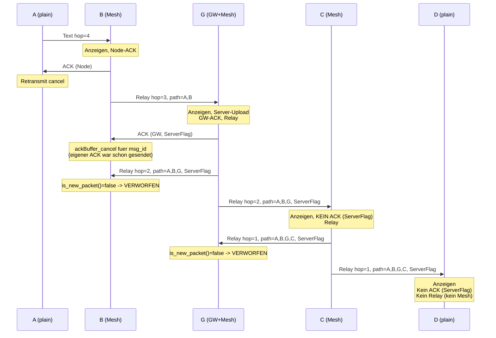

# MeshCom Firmware: Nachrichtentypen, Puffer und ACK-Analyse

## 1. Nachrichtentypen

| Byte | ASCII | Typ | Beschreibung | Retransmit | ACK erwartet |
|------|-------|-----|--------------|------------|--------------|
| `0x3A` | `:` | Text | Text, DM, Broadcast, Telemetrie, CET/MCP/SET | Ja (nur Originator) | Ja (bei Text) |
| `0x21` | `!` | Position | GPS-Koordinaten + Sensordaten | Nein (Fire&Forget) | Nein |
| `0x40` | `@` | HEY | Node-Discovery / Beacon | Nein (Fire&Forget) | Nein |
| `0x41` | `A` | ACK | Binary ACK (12 Byte, kein APRS-Frame) | Nein (Fire&Forget) | Nein |
| `0x3C` | `<` | LoRa-APRS | Raw APRS TNC2 (iGate-kompatibel) | Variabel | Nein |

### Ziel-Adressen bei Textnachrichten (0x3A)

| Ziel | Typ | ACK | Mesh-Relay | Server-Upload |
|------|-----|-----|------------|---------------|
| `*` | Broadcast | Ja (GW+Node) | Ja | Ja |
| `1`-`99999` | Gruppe | Ja (GW+Node) | Ja | Ja |
| `9` | HF-Gruppe | Ja | Ja (immer, unabh. von Gruppenkonfig) | Ja |
| `OE1ABC` | DM (Callsign) | Nur Empfaenger | Ja | Ja |
| `100001` | Telemetrie | Nein | Nein (am GW) | Ja |
| `WLNK-1` | Winlink | Ja | Nein (am GW) | Ja |
| `APRS2SOTA` | APRS2SOTA | Ja | Nein (am GW) | Ja |

---

## 2. Paketstruktur

### 2.1 Standard APRS-Paket (Typen 0x3A, 0x21, 0x40)

```
Byte  Feld                Beschreibung
[0]   payload_type        0x3A=Text, 0x21=Pos, 0x40=HEY
[1-4] msg_id              32-bit Message-ID (Little-Endian)
[5]   flags+max_hop       Bit[7]=Server, [6]=Track, [5]=AppOffline, [4]=Mesh, [3:0]=HopCount
[6..] source_path         "OE1KBC" oder "OE1KBC,OE1XYZ,OE2ABC" (variabel)
      '>'                 Separator
      dest_path            Zieladresse ("*", "OE1ABC", "12345", ...)
      payload_type         wiederholt als Separator
      payload              Nutzlast (Text, Position, "R" bei HEY)
      0x00                 Null-Terminator
      msg_source_hw        Hardware-Typ
      msg_source_mod       (Country<<4) | Modulation
      FCS_high/low         Frame Check Sequence
      fw_version           Firmware-Version
      msg_last_hw          HW des letzten Relays (Bit[7]=1 = letzter Sender)
      fw_sub_version       Sub-Version (ASCII)
      0x7E                 End-Marker
```

### 2.2 ACK-Paket (Typ 0x41, 12 Byte Binary)

```
Byte  Feld              Beschreibung
[0]   0x41              Typ-Marker 'A'
[1-4] ack_msg_id        Eigene ID des ACK-Pakets (millis()-basiert)
[5]   flags+max_hop     Bit[7]=ServerFlag, Bits[3:0]=MaxHop
[6-9] orig_msg_id       ID der quittierten Nachricht
[10]  ack_source         0x00=Node-ACK, 0x01=Gateway-ACK
[11]  0x00              Terminator
```

### 2.3 Flags in Byte [5]

```
Bit 7 (0x80)  msg_server      Nachricht wurde bereits an Server uebermittelt
Bit 6 (0x40)  msg_track       Position als Tracking gesendet
Bit 5 (0x20)  msg_app_offline Phone-App war nicht verbunden
Bit 4 (0x10)  msg_mesh        Sender hat MESH aktiv
Bit 3-0       max_hop         Verbleibende Hops (0-15)
```

---

## 3. Message-ID-Generierung

```
Normale Nachrichten:  msg_id = (MAC_22bit << 10) | (node_msgid & 0x3FF)
                      node_msgid = rollierender Zaehler 0-999 (in Flash)

ACK-Pakete:           ack_msg_id = millis()  (eigene ID)
                      orig_msg_id = msg_id der quittierten Nachricht

DM-ACK (:ackNNN):    msg_id = (MAC_22bit << 10) | (iAckId & 0x3FF)
```

---

## 4. Ringpuffer -- Uebersicht

### 4.1 Puffer-Dimensionen

| Puffer | Slots | Slot-Groesse | Zweck |
|--------|-------|-------------|-------|
| `ringBuffer` | 30 (20*) | 260 Byte | LoRa TX-Queue (Haupt-Sendepuffer) |
| `ackBuffer` | 16 (alle Builds) | 14 Byte | ACK Fast-Path (hoechste Prio) |
| `ringBufferLoraRX` | 60 (40*) | 5 Byte | "Schon gehoert" Dedup (msg_id + ServerFlag), eigene Konstante MAX_DEDUP_RING |
| `own_msg_id` | 30 (20*) | 5 Byte | Eigene gesendete msg_ids (fuer ACK-Matching) |
| `ringbufferRAWLoraRX` | 20 | 260 Byte | Raw RX Log (Debug/WebUI) |
| `ringBufferUDPout` | 20 | 275 Byte | UDP-Ausgang zum Server (nur GW) |
| `BLEtoPhoneBuff` | 30 | 305 Byte | BLE-Ausgang zum Handy |

\* = bei Builds mit ENABLE_XML oder ENABLE_SBUFFER: MAX_RING=20, MAX_DEDUP_RING=40

### 4.2 ringBuffer -- Status-Byte [1]

| Wert | Bedeutung |
|------|-----------|
| `0x00` | In Queue, noch nicht gesendet, Retransmit aktiv |
| `0x01`-`0xFE` | Gesendet, Timer-Ticks seit letztem TX (alle 2s +1) |
| `0xFF` | Fire-and-Forget, kein Retransmit |

### 4.3 Was kommt in welchen Puffer?



---

## 5. ACK-System

### 5.1 ACK-Typen

| ACK-Typ | Sender | ServerFlag | Byte[10] | Wann |
|---------|--------|------------|----------|------|
| Gateway-ACK | GW-Node | Ja (0x80) | 0x01 | Broadcast/Gruppe empfangen, GW hat IP |
| Node-ACK | Jeder Node | Nein | 0x00 | Broadcast/Gruppe empfangen, kein GW |
| DM-ACK (APRS) | Empfaenger | -- | -- | `:ackNNN` im Payload bei DM |

### 5.2 ACK-Fluss



### 5.3 Wann wird Retransmit gecancelt?

1. **ACK empfangen** (0x41 mit passender orig_msg_id) -> ringBuffer-Slot geloescht
2. **HEARD** (eigene Nachricht von anderem Node gerelayed gehoert) -> ringBuffer-Slot geloescht
3. **DM :ack empfangen** -> ringBuffer-Slot auf 0xFF gesetzt
4. **Max Retries erreicht** (retryCount >= MAX_RETRANSMIT=3) -> Slot freigegeben
5. **Puffer voll** bei Retransmit-Versuch (pending >= MAX_RING-2) -> Slot gedroppt

### 5.4 Retransmit-Timing

```
Basis:     ~34 Sekunden
Jitter:    +/- 10 Sekunden (basierend auf msg_id Hash, deterministisch)
Intervall: 24-44 Sekunden zwischen Retransmits
Timer:     updateRetransmissionStatus() alle 2 Sekunden
Max:       retryCount >= MAX_RETRANSMIT (3), dann Aufgabe
           Effektive Retries haengen vom Startwert von retryCount ab:
             Eigene Textnachricht (BLE/lokal): retryCount=0 -> 3 Retries
             UDP DM (persoenliche Nachricht):  retryCount=1 -> 2 Retries
             UDP Broadcast/Gruppe:             retryCount=2 -> 1 Retry
             UDP CET/SET, Pos, HEY, Relay:     Status=0xFF  -> kein Retry
```

---

## 6. TX-Prioritaeten

```
Prioritaet 1 (HOECHSTE):  ackBuffer (16 Slots)
                           -> ACKs werden IMMER vor normalen Nachrichten gesendet
                           -> Einfaches CAD ohne adaptiven Backoff

Prioritaet 2 (NORMAL):    ringBuffer (30 Slots)
                           -> Alle anderen Nachrichten
                           -> Volles CSMA-CA mit adaptivem Backoff
                           -> Watchdog nach 30s erzwingt TX
```

### CSMA-CA Ablauf (SX126x)



---

## 7. Verhalten nach Node-Konfiguration

### 7.1 Verhaltensmatrix

| Modus | LoRa Relay | Server Upload | Server Download | ACK-Typ |
|-------|------------|---------------|-----------------|---------|
| Mesh=OFF, GW=OFF | Nein | Nein | Nein | Keiner |
| Mesh=ON, GW=OFF | Ja | Nein | Nein | Node-ACK |
| Mesh=OFF, GW=ON | Nein | Ja | Ja | GW-ACK |
| Mesh=ON, GW=ON | Ja | Ja | Ja | GW-ACK |

### 7.2 Empfangs-Entscheidungsbaum



---

## 8. Szenarien

### 8.1 Szenario: UDP-Paket vom Server -> LoRa



**Retransmit:** Abhaengig vom Nachrichtentyp:
- DM (persoenlich): 2 Retries (retryCount startet bei 1)
- Broadcast/Gruppe: 1 Retry (retryCount startet bei 2)
- CET/SET: Fire&Forget (Status=0xFF)

### 8.2 Szenario: Lokaler Node sendet Textnachricht

#### An Broadcast `*`



#### An Gruppe (z.B. "12345")

Identisch zu Broadcast, ausser:
- Nur Nodes die Gruppe 12345 konfiguriert haben (oder keine Gruppen konfiguriert haben) zeigen die Nachricht an
- Alle Mesh-Nodes relayed unabhaengig von Gruppenzugehoerigkeit

#### An Callsign (DM, z.B. "OE1ABC")

- Nur der Empfaenger (OE1ABC) zeigt an und sendet DM-ACK (`:ackNNN` im Payload)
- Zwischen-Nodes senden KEINEN ACK, relayed nur per Mesh
- Der Sender retransmitted bis DM-ACK kommt (max 3x lokal, max 2x bei UDP)

### 8.3 Szenario: LoRa-Paket empfangen (nach Node-Typ)

```
+------------------+----------+----------+----------+----------+
| Aktion           | Kein M/G | Mesh ON  | GW ON    | Mesh+GW  |
+------------------+----------+----------+----------+----------+
| Anzeigen/BLE     | Ja       | Ja       | Ja       | Ja       |
| LoRa Relay       | Nein     | Ja       | Nein     | Ja       |
| Server Upload    | Nein     | Nein     | Ja*      | Ja*      |
| GW-ACK senden    | Nein     | Nein     | Ja*      | Ja*      |
| Node-ACK senden  | Nein     | Ja*      | Nein     | Nein     |
+------------------+----------+----------+----------+----------+
* = nur wenn ServerFlag NICHT gesetzt ist
```

---

## 9. Szenarien-Simulation

### 9.1 Zwei Nodes: A (kein GW/Mesh) <-> G (GW+Mesh)

Jeder hoert jeden direkt.

#### Text von A an `*`

```
A sendet:   ringBuffer Status=0x00, hop=4, insertOwnTx()
G empfaengt: Anzeigen, Server-Upload, GW-ACK senden, Relay (hop=3, ServerFlag)
A empfaengt GW-ACK: Retransmit gecancelt
A empfaengt Relay:  is_new_packet()=false -> ignoriert (oder HEARD -> cancel)

Puffer-Bilanz:
  A: ringBuffer 1 Slot (frei nach ACK), own_msg_id 1, ringBufferLoraRX 1
  G: ringBuffer 1 Slot (Relay, 0xFF), ackBuffer 2 (GW-ACK), ringBufferLoraRX 1
```

#### Position von A

```
A sendet:   ringBuffer Status=0xFF, hop=2
G empfaengt: Anzeigen, Server-Upload, Relay (hop=1, ServerFlag)
             KEIN ACK fuer Positionen

Puffer-Bilanz: Minimal (alle Fire&Forget)
```

#### HEY von A

```
A sendet:   ringBuffer Status=0xFF, hop=4, dest="H"
G empfaengt: mheard aktualisieren, Relay (hop=3, RSSI/SNR angeheangt)
             KEIN ACK fuer HEY

Puffer-Bilanz: Minimal
```

#### Text von G (vom Server via UDP) an `*`

```
Server->G:  UDP "GATE" Paket
G sendet:   ringBuffer Status=0x00, retryCount=2 (1 Retry fuer Broadcast)
            ServerFlag=true, insertOwnTx(msg_id)
A empfaengt: Anzeigen, KEIN ACK (ServerFlag), KEIN Relay (kein Mesh)

Falls kein ACK innerhalb 24-44s: 1 Retry, dann Aufgabe.
Bei DM (z.B. an OE1ABC): retryCount=1 -> 2 Retries.
Bei CET/SET: Status=0xFF, kein Retry.
```

### 9.2 Voll vermaschtes Quadrat: A, B, C (Mesh ON) + G (GW+Mesh)

```
Jeder hoert jeden:

    A ---- B
    |  \/  |
    |  /\  |
    C ---- G
```

#### A sendet Textnachricht an `*`, hop=4

```
Zeitpunkt T0: A sendet (msg_id=42)
  -> B, C, G empfangen gleichzeitig

Zeitpunkt T1:
  G: GW-ACK (2x ackBuffer), Server-Upload, Relay (hop=3, ServerFlag, path=A,G)
  B: Node-ACK (ackBuffer), Relay (hop=3, path=A,B)
  C: Node-ACK (ackBuffer), Relay (hop=3, path=A,C)

Zeitpunkt T2 (ACKs kommen bei A an):
  A: Erster ACK -> Retransmit cancel, own_msg_id=0x02
  A: Weitere ACKs -> Zusaetzliche BLE-Notifications (Duplikate)

Zeitpunkt T2-T3 (Relays kommen an):
  Jeder empfaengt Relays von den anderen:
  - B empfaengt Relay von G: is_new_packet()=false -> VERWORFEN
  - B empfaengt Relay von C: is_new_packet()=false -> VERWORFEN
  - C empfaengt Relay von G: is_new_packet()=false -> VERWORFEN
  - usw.

  ABER: ACK-Pakete (0x41) werden AUCH dedupliziert:
  - B hoert GW-ACK von G fuer msg_id=42: ackBuffer_cancel_msgid(42)
    -> Wenn B's eigener ACK noch im ackBuffer steht, wird er gecancelt!
  - C hoert GW-ACK von G: ebenso cancel
```

**Puffer-Belastung pro Nachricht (worst case):**

```
ringBufferLoraRX:  1 Nachrichten-ID + 4 ACK-IDs = 5 Eintraege
                   (Relays tragen dieselbe msg_id -> kein extra Slot!
                    aber jeder ACK hat eigene ack_msg_id)
ackBuffer:         G: 2, B: 1, C: 1 -> Max 4 gleichzeitig
                   (reduziert durch cancel wenn GW-ACK zuerst kommt)
ringBuffer:        G: 1 Relay, B: 1 Relay, C: 1 Relay = 3 Slots
own_msg_id (A):    1 Eintrag
```

### 9.3 Perlenschnur: A -- B -- G -- C -- D (nur Nachbarn hoerbar)

```
A <-> B <-> G <-> C <-> D
         (GW+Mesh)
B, C = Mesh ON
A, D = kein Mesh, kein GW
```

#### A sendet Text an `*`, hop=4



**Hops verbraucht:** A->B (4), B->G (3), G->C (2), C->D (1) -> Genau 4 Hops, passt.

**ACK-Rueckweg:** A bekommt nur ACK von B. Kein ACK von G/C/D direkt (nicht hoerbar). Die GW-ACK von G geht an B, B koennte sie weiterleiten (ACK hop-- und Mesh-Relay), aber:
- B's ACK-Relay geht an A -> A empfaengt GW-ACK als Bestaetigung "Server erreicht"

### 9.4 Perlenschnur mit GW-Only (ohne Mesh): A -- B -- G -- C -- D

```
G hat: GW=ON, Mesh=OFF
B, C haben: Mesh=ON
A, D haben: nichts
```

#### A sendet Text an `*`, hop=4

```
A -> B: Text hop=4
  B: Anzeigen, Node-ACK an A, Relay hop=3

B -> G: Relay hop=3, path=A,B
  G: Anzeigen, Server-Upload, GW-ACK an B
  G: KEIN Relay (Mesh=OFF!)

-> C und D bekommen die Nachricht NICHT ueber LoRa!
-> C und D bekommen sie nur, wenn der Server sie via UDP zurueckschickt
   und ein anderer GW in Reichweite von C/D sie aussendet
```

**Problem:** Bei GW-Only ohne Mesh endet die Kette am Gateway. Nachrichten von der "anderen Seite" kommen nur ueber den Server-Rueckweg.

---

## 10. Puffer-Kapazitaetsanalyse

### 10.1 Annahme: 10 Nodes, davon 2 Gateways, alle Mesh aktiv

Jeder hoert jeden (worst case).

#### Eine einzelne Textnachricht (Broadcast)

```
ringBufferLoraRX (Dedup, 60 Slots / MAX_DEDUP_RING):
  WICHTIG: Alle Relays tragen dieselbe msg_id wie das Original!
  is_new_packet() prueft per memcmp nur die 4-Byte msg_id.
  -> 1 Broadcast belegt nur 1 Dedup-Slot fuer die Nachricht selbst.

  ABER: Jeder ACK hat eine EIGENE ack_msg_id (millis()-basiert)!
  -> Jeder ACK belegt einen separaten Dedup-Slot.
  -> Bei 10 Nodes (2 GW, 1 Sender, 7 Mesh):
     2 GWs * 2 ACKs = 4 GW-ACK-IDs
     7 Mesh-Nodes * 1 ACK = 7 Node-ACK-IDs
     + 1 Nachrichten-ID
     = 12 Dedup-Eintraege pro Broadcast

  -> Bei 5 gleichzeitigen Broadcasts: 60 Eintraege -> Puffer VOLL (60)
     (mit alten 30 Slots war bei 3 Broadcasts Schluss)

ackBuffer (16 Slots / MAX_ACK_RING):
  2 GWs senden je 2 ACKs = 4 ACKs
  7 Mesh-Nodes senden je 1 ACK = 7 ACKs
  -> 11 ACKs total, aber jeder Node sieht nur die ACKs in Reichweite
  -> Jeder der 9 empfangenden Nodes will einen ACK senden
  -> ackBuffer_cancel_msgid reduziert: GW-ACK cancelt Node-ACKs
  -> 16 Slots bieten genuegend Headroom fuer 10-Node-Szenarien

ringBuffer (30 Slots):
  9 Nodes relayed die Nachricht = 9 Slots (alle 0xFF)
  -> Plus eigene Nachrichten
  -> Bei 3 gleichzeitigen Broadcasts: 27 Relay-Slots -> fast voll!
```

#### Hochrechnung: Nachrichten pro Minute

```
Wenn jeder der 10 Nodes alle 5 Minuten eine Nachricht sendet:
  = 2 Nachrichten/Minute

ringBufferLoraRX (60 Slots / MAX_DEDUP_RING, kein Expiry!):
  Pro Broadcast: 1 msg_id + ~11 ACK-msg_ids = 12 Dedup-Eintraege
  (Nachricht: 1 Slot, ACKs: je 1 Slot wegen eigener ack_msg_id)
  60 Slots / 12 = 5 Broadcasts bevor Ueberschreiben
  Bei 2 msg/min: Dedup-Fenster = ~150 Sekunden

  Retransmit-Intervall = 24-44 Sekunden -> passt komfortabel ins Fenster.
  Bei sehr hoher Last (>5 Broadcasts in 44s) kann ein Retransmit
  ankommen, nachdem seine msg_id schon ueberschrieben wurde.

  Haupttreiber des Dedup-Verbrauchs sind die ACK-IDs, nicht die
  Nachrichten-Relays (die alle dieselbe msg_id tragen).
```

### 10.2 Kritische Puffer-Engpaesse

```
+---------------------------+-------+------------------------------------+
| Puffer                    | Slots | Kritisch bei                       |
+---------------------------+-------+------------------------------------+
| ackBuffer                 |  16   | >8 Nodes mit Mesh/GW in Reichweite |
|                           |       | (genuegend Headroom fuer 10 Nodes) |
+---------------------------+-------+------------------------------------+
| ringBufferLoraRX (Dedup)  |  60   | >5 gleichzeitige Broadcasts        |
|                           |       | bei 10 Nodes (~12 IDs pro Broadcast|
|                           |       | wegen ACK-msg_ids, nicht Relays!)  |
|                           |       | KEIN ZEITLICHES EXPIRY!            |
+---------------------------+-------+------------------------------------+
| ringBuffer (TX)           |  30   | >3 gleichzeitige Broadcasts        |
|                           |       | (je 9 Relay-Kopien)                |
+---------------------------+-------+------------------------------------+
```

### 10.3 ACK-Storm-Analyse

```
10 Nodes, jeder hoert jeden, 2 davon GW:

Node A sendet Broadcast (9 Empfaenger: 2 GW + 7 Mesh):
  -> 2 GWs senden je 2 GW-ACKs = 4 ACK-Pakete
  -> 7 Mesh-Nodes senden je 1 Node-ACK = 7 ACK-Pakete
  -> Total: 11 ACK-Pakete auf dem Kanal
     (jeder ACK hat eigene ack_msg_id -> 11 Dedup-Eintraege!)

  Jeder dieser ACKs wird auch per Mesh gerelayed!
  -> 9 Nodes relayed jeden der 11 ACKs = 99 ACK-Relays
  -> ABER Dedup faengt die meisten ab (gleiche ack_msg_id = Duplikat)

  Trotzdem: in den ersten Millisekunden:
  -> Alle 9 empfangenden Nodes wollen ACK senden
  -> ackBuffer hat nur 8 Slots
  -> Mindestens 1 ACK wird gedroppt: "ACK_FWD_DROPPED ack_buf_full"

  Und: 9 Relay-Kopien der Nachricht + 11 ACKs + deren Relays
  -> Kanalauslastung explodiert
  -> CSMA-CA Backoff wird maximal
  -> Weitere Nachrichten stauen sich
```

### 10.4 Dedup-Puffer-Ueberlauf-Kaskade

```
Szenario: 10 Nodes, alle Mesh+GW aktiv

Korrekte Dedup-Berechnung pro Broadcast:
  1 Nachrichten-msg_id (Relays tragen DIESELBE msg_id!)
  + ~11 ACK-msg_ids (jeder ACK hat eigene millis()-basierte ID)
  = ~12 Dedup-Eintraege pro Broadcast

1. Node A sendet Text -> 12 Dedup-Eintraege (1 msg + 11 ACKs)
2. Node B sendet Text -> weitere 12 Eintraege (24/30)
3. Node C sendet Text -> weitere 12 Eintraege -> Dedup-Puffer VOLL
   (36 > 30, aelteste Eintraege werden ueberschrieben)

4. Node A's Retransmit (nach 30s):
   -> A's msg_id wurde moeglicherweise schon ueberschrieben
   -> is_new_packet() = TRUE fuer den Retransmit!
   -> Nachricht wird ERNEUT verarbeitet
   -> ERNEUT gerelayed
   -> ERNEUT ACKs generiert (weitere 11 ACK-msg_ids!)
   -> Kaskade bis max_hop aufgebraucht

Haupttreiber: Die ACK-msg_ids fuellen den Dedup-Puffer, nicht
die Nachrichten-Relays (die alle dieselbe msg_id tragen).
```

---

## 11. Identifizierte Probleme und Empfehlungen

### Problem 1: ackBuffer -- geloest

**Symptom:** `ACK_FWD_DROPPED ack_buf_full` in Logs
**Loesung:** MAX_ACK_RING von 8 auf 16 vergroessert. Genuegend Headroom fuer 10-Node-Szenarien.
**Offen:** ACK-Suppression (nur GW-ACK senden wenn GW vorhanden) wuerde die ACK-Last weiter reduzieren.

### Problem 2: ringBufferLoraRX -- entschaerft

**Symptom:** Bei hoher Nachrichtendichte werden alte msg_ids zu frueh ueberschrieben
**Loesung:** MAX_DEDUP_RING auf 60 vergroessert (entkoppelt von MAX_RING). Dedup-Fenster verdoppelt.
**Offen:** Kein zeitliches Expiry. Bei >5 gleichzeitigen Broadcasts in 44s kann der Puffer ueberlaufen.
**Moegliche Erweiterung:** Getrennte Dedup-Puffer fuer Nachrichten und ACKs (siehe ringbuffer-discussion.md)

### Problem 3: Zu viele Nodes mit GW+Mesh verursachen ACK-Multiplikation

**Symptom:** Jeder GW sendet 2 ACKs, jeder Mesh-Node sendet 1 ACK, alle werden per Mesh gerelayed
**Ursache:** Kein Mechanismus zur ACK-Unterdrueckung bei Redundanz
**Empfehlung:**
- Zufaellige ACK-Verzoegerung (bereits teilweise durch CSMA, aber ACK hat Prioritaet und umgeht adaptiven Backoff)
- ACK-Suppression: wenn innerhalb X ms ein anderer ACK fuer dieselbe msg_id gehoert wird, eigenen ACK canceln (teilweise implementiert via `ackBuffer_cancel_msgid`, aber Timing-Race)
- Begrenzung: maximal 1 GW-ACK pro msg_id im Netz (erster GW gewinnt)

### Problem 4: Quadratische Nachrichtenkomplexitaet

**Symptom:** Bei N Nodes und einer Broadcast-Nachricht: N-1 Relays + N-1 ACKs + ACK-Relays
**Ursache:** Jeder Node mit Mesh relayed und ACKt, und jeder Relay/ACK wird wieder gerelayed
**Empfehlung:**
- Max-Hop fuer ACKs separat konfigurierbar machen (z.B. ACK hop=1)
- Relay-Unterdrueckung wenn Nachricht schon von >2 Nodes gehort

### Problem 5: GW-Only ohne Mesh unterbricht die Kette

**Symptom:** Nodes hinter einem GW-Only-Knoten in einer Perlenschnur sind nur ueber den Server erreichbar
**Auswirkung:** Latenz steigt drastisch, Abhaengigkeit vom Server

---

## 12. Zusammenfassung der Puffer-Dimensionierung

```
Aktuelle Groessen (Stand Firmware-DEV):

ringBufferLoraRX:  60 Slots (MAX_DEDUP_RING, entkoppelt von MAX_RING)
                   Ausreichend fuer ~5 gleichzeitige Broadcasts bei 10 Nodes
                   (~12 Dedup-Eintraege pro Broadcast)

ackBuffer:         16 Slots (MAX_ACK_RING)
                   Genuegend Headroom fuer 10-Node-Szenarien

ringBuffer:        30 Slots (MAX_RING) -> AUSREICHEND

own_msg_id:        30 Slots (MAX_RING) -> OK

Fuer 20+ Nodes: Architektur ueberdenken
(getrennte Dedup-Puffer fuer Nachrichten/ACKs, ACK-Suppression, zeitliches Expiry)
```
